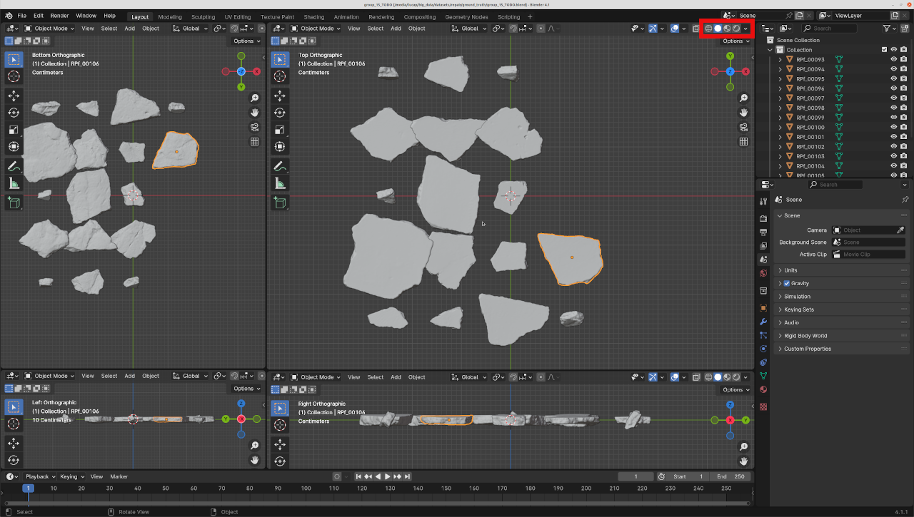
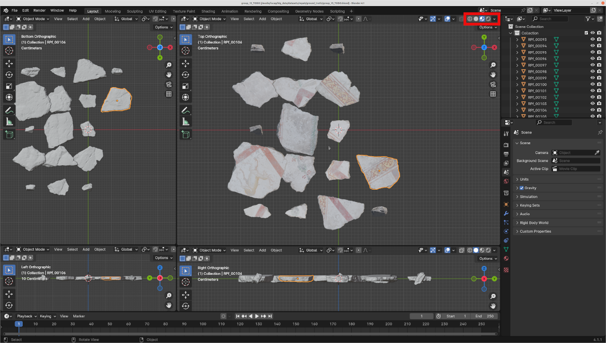
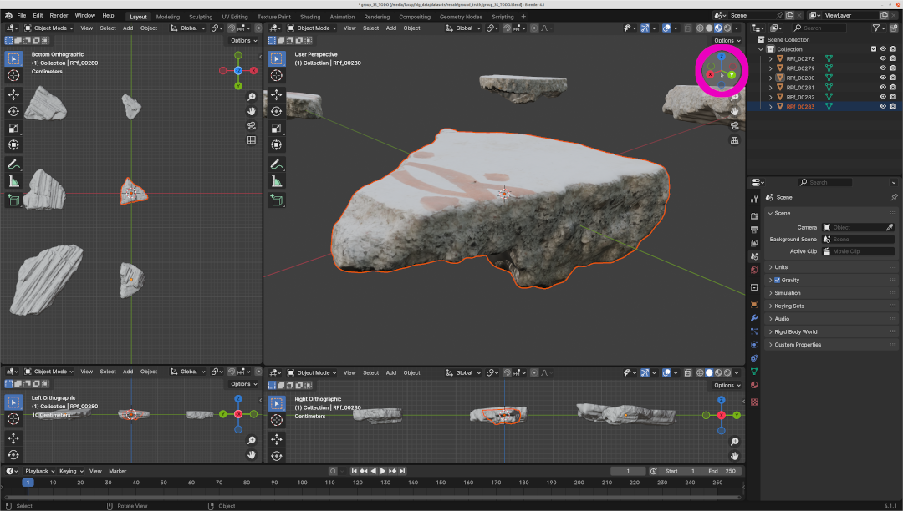
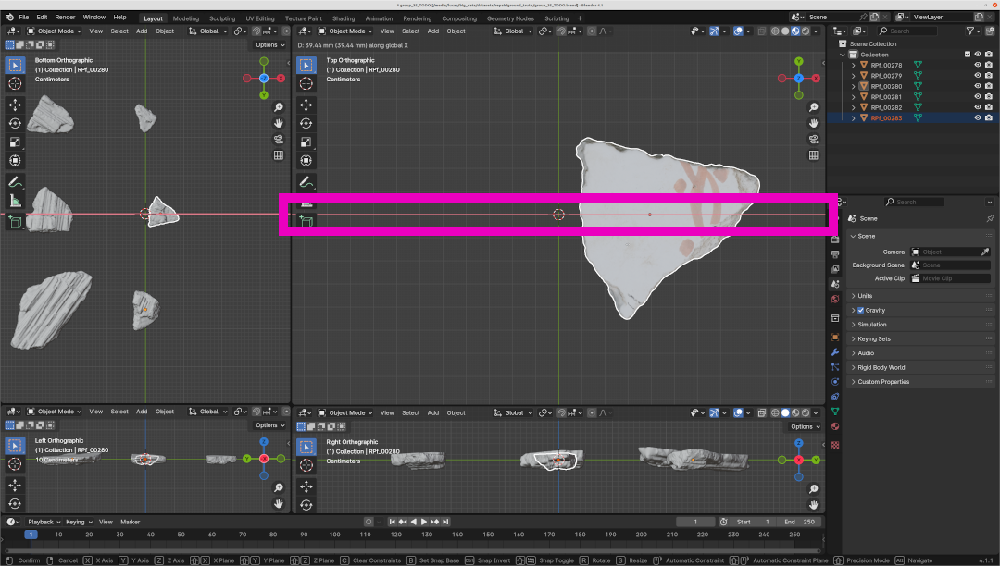
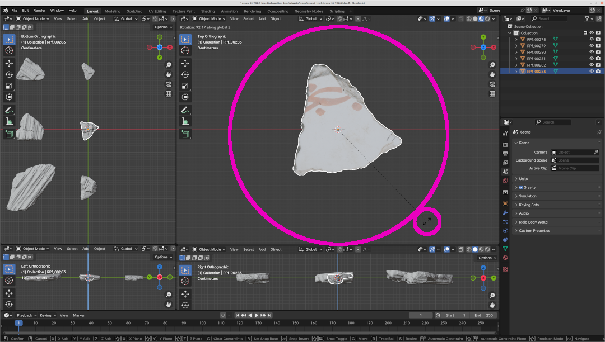
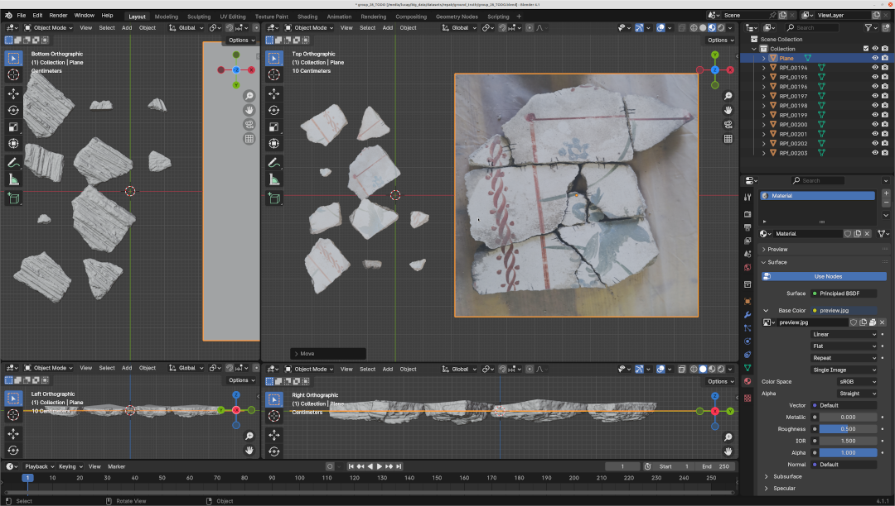
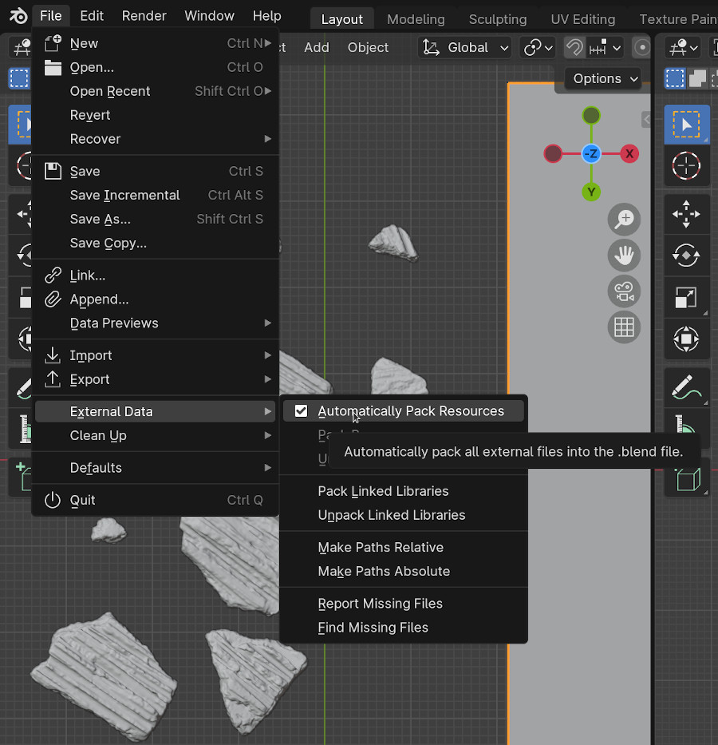
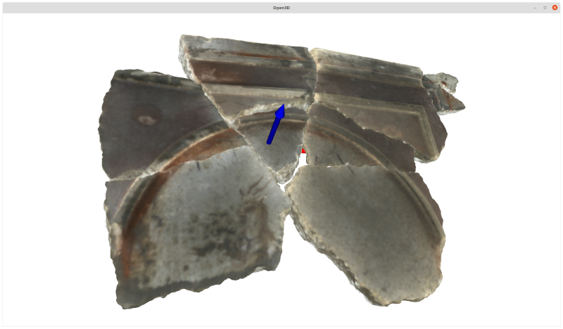

# Ground Truth for the RePAIR Project
Guide for creating the ground truth for the RePAIR Project

We agreed on creating a digital ground truth using [Blender](#blender) to align the pieces manually. 
This ensure that the following pipeline is reproducible for longer time (Blender is independently maintained and has a large community) and easier to use for anyone (lots of resources to learn to use Blender), plus it reduces time spent on reinventing the wheel (few code to be written on our side).

## Index
- If you need to prepare the data, go to [Section 1](https://github.com/RePAIRProject/repair_ground_truth?tab=readme-ov-file#1-data-preparation)
- If you want to assemble puzzles, go to [Section 2](https://github.com/RePAIRProject/repair_ground_truth/tree/main?tab=readme-ov-file#2-aligning-the-pieces-with-blender)
- If you want to save the solved puzzle, go to [Section 3](https://github.com/RePAIRProject/repair_ground_truth/tree/main?tab=readme-ov-file#3-finishing)
- If you want to generate ground truth json file, go to [Section 4](https://github.com/RePAIRProject/repair_ground_truth/tree/main?tab=readme-ov-file#4-ground-truth-generation)
- If you have ground truth and want to have a reference script for reconstruction, go to [Section 5](https://github.com/RePAIRProject/repair_ground_truth/tree/main?tab=readme-ov-file#5-reconstruction-reference)

## 1. Data preparation
To *prepare* the fragments there is a python script [`prepare_puzzle_blender.py`](https://github.com/RePAIRProject/repair_ground_truth/blob/main/prepare_puzzle_blender.py) which will create a `.blend` file with the pieces aligned on a virtual grid in the origin.
This can be run by one person to prepare all the groups.

The command to run is:
```bash 
blender --background --python prepare_puzzle_blender.py
```

## 2. Aligning the pieces with Blender
[Blender](https://www.blender.org/) is a well-known open source tool for working with three-dimensional data.
It can be downloaded from [the website](https://www.blender.org/download/) and is supported on MacOS, Windows and Linux.
It has a lot of built-in features and can be used for many purposes.
However, there may be a steep learning curve in the first uses.
Luckily, to create the ground truth you *do not need to be an expert* in Blender, but just some basic functionalities.

At any point, if you find anything unclear, please refer to the official [documentation](https://docs.blender.org/manual/en/latest/contribute/index.html) or to the many resources available online.

| ⚠️  **WARNING:**  it is strongly suggested to use a mouse for this task. |
|-----------------------------------------|

### Enabling Color Rendering
If you download a `.blend` file prepared with the python script, it should opens up with 4 views (from different sides) of the pieces. 
By default, you have the `solid` viewport shading mode (meaning you only see gray pieces). You can enable the `material preview` viewport shading mode to see the texture on the pieces, as shown in the image.

| Default | Colors |
|:-------:|:------:|
|||

This is a bit more computationally expensive, so if you see that your computer does not manage, you can solve the puzzle without texture. 

### Moving around the scenes
To move around the scene, you can hold down the wheel button (on your mouse) or use the gizmo on the top right of your interface (see figure).

| Use the gizmo to see around the scene |
|:-------------------------------------:|
||

This should help you to check around the scene. By clicking on the axis on the gizmo, you can establish a perpendicular view (particularly useful to align the pieces in all axis).

### Moving the pieces around
To move the pieces, you first have to select them (one at a time or multiple at the same time). You select them by simply left-clicking on them.
Once a piece is selected, you can start moving them by using the keyboard shortcut `G`. (Note: remember to have your mouse pointer in the window where you want to move. If you are in a different window, `G` will do other stuff).
Once you pressed `G`, just moving the mouse allows you to move the pieces freely in the scene (no need to press any button on the mouse). You can see that the movement is visible from all axis. Although this is the quickest option, you may find it hard to align perfectly in 3D.
You can move the pieces also by clicking the arrows instead of using the mouse, if this helps.

You can **constrain** the movement on one-axis only by pressing the key related to the axis, so `X`, `Y` or `Z`. For example, pressing `G` and then `X` allows you to move the piece horizontally (see image). 

| Moving along the `X` axis|
|:-------------------------------------:|
||

When you are satisfied with the position, you can click `ENTER` or left-click the mouse to place thefragment there. If at any point you want to discard the movement, just press `ESC`. 
You can repeat the movement as many times as you need.

### Rotating the pieces
Rotating the pieces (on itself) is very similar, but instead of using `G`, you press `R`. Once you press `R`, any movement of your mouse (or click of one arrow) will rotate the piece. Here again, pressing `X`, `Y` or `Z` will rotate the piece only around that axis (as shown in the figure).

| Rotating around the `Z` axis |
|:-------------------------------------:|
||

### Checking the solution
As a reference solution of each *group* we have `preview` images available. They are available in the github repo (currently private, if you do not have access, please reach out). Using these images as a reference, the solution should be easier to find.

##### Extra: Using the solution as a background
If you are a pro and want to have the reference image within Blender, you can add a Plane Mesh `SHIFT + A` and select `MESH` and then `PLANE`, go its material, add a new material, instead of the white color select `IMAGE TEXTURE` and open as texture the preview image. The result is shown in the figure below.

| Reference image as a plane |
|:-------------------------------------:|
||

You can also tweak the aspect ratio and scale it to get the correct size. This may be helpful to know where to place the pieces. You can also use it as a canvas to place the piece on top of it.

## 3. Finishing
Once
Once you are happy with the solution, you can save the file with a new name. 
**WARNING**: before saving, you need to check that you are saving all resources. You can check it on the top bar (top left) in `FILE` --> `EXTERNAL DATA` --> `Automatically Pack Resources` (it should be ticked!). See image below.

| `Automatically Pack Resources` set to True |
|:-------------------------------------:|
||

Then select `FILE` --> `SAVE AS` (or `SHIFT + CTRL + S` and save it as `group_XX_DONE.blend` (it was previously `group_XX_TODO.blend`). 
This file should be uploaded and will be used to export the ground truth positions and rotations.

Thanks!

## 4. Ground Truth Generation
To generate the ground truth, we use a second script (`export_solutions.py`), which can be launched with:
```bash
blender --background --python export_solutions.py
```
This will create a `JSON` file for each solved group (in the `DONE` folder).

## 5. Reconstruction Reference
To understand how to use the data, we provide a script to read and process the meshes. 
By giving the root folder (where the `.obj` meshes are, including material and texture) and the `JSON` file, it places the pieces in the correct position and orientation.

Command is:
```bash
python reconstruct_open3d.py -r /root_folder -j /~/group_XX.json
```
And it should output something like this:
| Reconstruction with open3d |
|:-------------------------------------:|
||