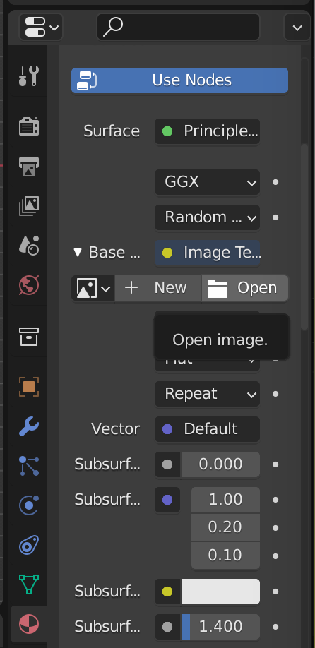

# Ground Truth for the RePAIR Project
Guide for creating the ground truth for the RePAIR Project

We agreed on creating a digital ground truth with digital 3D tools (controlled by an expert in the field of archaeology).
We selected 2 possibilities:
- Using [Blender](#blender) to align the pieces manually
- Using the [Fragment Reassembler](#fragment-reassembler) tool to select contact points between each pair of pieces and snap them together

For more information, check the sections below (more material and screenshots will come).

## Blender
[Blender](https://www.blender.org/) is a well-known open source tool for working with three-dimensional data.
It can be downloaded from [the website](https://www.blender.org/download/) and is supported on MacOS, Windows and Linux.
It has a lot of built-in features and can be used for many purposes.
However, there may be a steep learning curve in the first uses.
Luckily, to create the ground truth you *do not need to be an expert* in Blender, but just some basic functionalities.

The workflow includes a pre-processing step to *prepare the files* for an easier manipulation.

### Pre-processing
The pre-processing consists in aligning the center of mass of the object to the (0,0,0) coordinates, and rotate it so that the top flat surface is facing up.
It should be done for every group of pieces that has to be aligned. However, this can be done previously and results can be saved in a blender `.blend` file, so if this has been prepared, one can follow from the [aligning fragments](#aligning-fragments) section.

This can be done via the provided [`prepare_for_gt_blender.py`](https://github.com/RePAIRProject/repair_ground_truth/blob/main/prepare_for_gt_blender.py) script.

The script can be customized passing some parameters. For more details check the code or the [`details_script`](https://github.com/RePAIRProject/repair_ground_truth/blob/main/details_script.md) guide.
The outputs of the pre-processing are the prepared `.ply` files.

##### Using the template
You can start by opening in Blender the `scene_template.blend` file. It should provide already a collection with a large plane (with a texture image node) and a collection named `Fragments` which is empty.

##### Importing `.ply` in Blender
You cannot *open* the files in Blender, you have to import them.
Select the collection `Fragments` and then just click on `File-->Import-->Stanford (.ply)`. You can add all of them at once.

An example of import of `.ply` files

##### Display colors
When importing these in Blender, colors will not be shown because the colors are in the vertices and not in the faces.
To solve this, you have to assign to each piece the material `VertexColors` which will do exactly this (it adds an input node for `Vertex Color`).

If you look into the node editor, you will see the input node for the vertex color (when selecting the correct material)

To assign the material, use the ball icon in the right, and instead of creating a new one, choose `VertexColors` from the list.

If you select the correct material and go to the viewport mode and enable the material rendering, you should see the actual textures.

##### Adding a reference image in the background

If you need a reference image (for example, the image of the physical fragments assembled), you can add it to the large plane in the scene.
In the outline (top right) go to the Background collection, select the plane and go to the material tab (the ball icon).

There you should a `Base Color` (sometimes abbreviated as `Base..` if you have a small screen) with `Image Texture`. Open the field and click on `Open Image` and select the image you want.
It should appear (if you enable rendering) in the large plane (you can scale the plane by selecting it and pressing `S` if you need to scale the image). You can always toggle the visibility of the plane/background image from the outline (top right, use the little eye icon).

### Aligning Fragments
After pre-processing (or after getting the prepared `.blend` file) the alignment can be done in two sequential steps:
- rough alignment on a virtual 2D plane based on shape and texture
- fine tuning of the position and rotation of each fragment
These steps are supposed to emulate the steps of an archaeologist working with the actual pieces.

##### Step 1: Rough alignment on a virtual 2D plane
Setting the camera position in the z-axis and orthogonally to the xy-plane (by pressing `7` on the keyboard or by using the gizmo in Blender pressing on `Z`) and setting the projection mode to orthogonal (pressing `5`), the fragments will be seen from a 2D perspective and can be moved around (first selecting a piece, then enabling the movement by pressing `G`) to a roughly correct position.

The pieces needs to be rotated (only around the z-axis at this point) and this can be done, once they are selected, by pressing `R` and then `Z`.

##### Step 2: Fine tuning and final solution
Once a rough alignment has been obtained, the fine tuning step starts. Using the hand below the gizmo on the top-right of the 3D Viewport, we can move around the scene and zoom in to see the alignment better, and we can now move around the camera (holding the wheel button down and moving the mouse) to check the alignment from different perspectives.

If needed, there is the possibility of checking the fragment from above (pressing `7`), from the side (pressing `1` for the y-axis or `3` for the x-axis) or from the bottom (pressing `9`).

Moving the fragments can be done after selecting a fragment by pressing `G` (caution: this will move freely in the 3D world, so be sure to check in which direction you are moving). To constrain the movement in only one axis, press `X`, `Y` or `Z` after `G` (for example, to move a piece only around the z-axis, so to move it up or down, select it, press `G` and then `Z` then move the mouse).

## Fragment Reassembler
The [fragment reassembler](http://vcg.isti.cnr.it/~pietroni/reassembly/index.html) is a tool from the [Visual Computing Laboratory](http://vcg.isti.cnr.it/), [ISTI](https://www.isti.cnr.it/en/) and [CNR](https://www.cnr.it/) partially funded by [EC IP “3DCOFORM”](https://www.3d-coform.eu/) which is available online alongside with [the scientific paper](http://vcg.isti.cnr.it/Publications/2013/PPCS13/reassembly_DH13_final.pdf) which explains it in terms of usage and functionalities.

The program can be downloaded [from the website](http://vcg.isti.cnr.it/~pietroni/reassembly/download.html) and works on Windows (or under Wine on Unix systems).

The program works by importing two fragments in the two working areas and selecting corresponding points between them. The color information is visible and fragments can be rotated to check the matching surfaces.
Once the corresponding points on the two fragments are found, they can be selected by clicking on them (in the working areas) and added as a constraint by pressing the button `add constraint`. Once some constraints have been added (minimum 2, usually 5-6 ensure good results) the button `solve` can be clicked, and the system aligns the fragments.

Constraints can always be added afterwards (and deleted) so this operation can be repeated many times until a satisfying solution is found.

An overview and tutorial of the system is available in [this video](https://www.youtube.com/watch?v=wn9_b9YZhU0).
